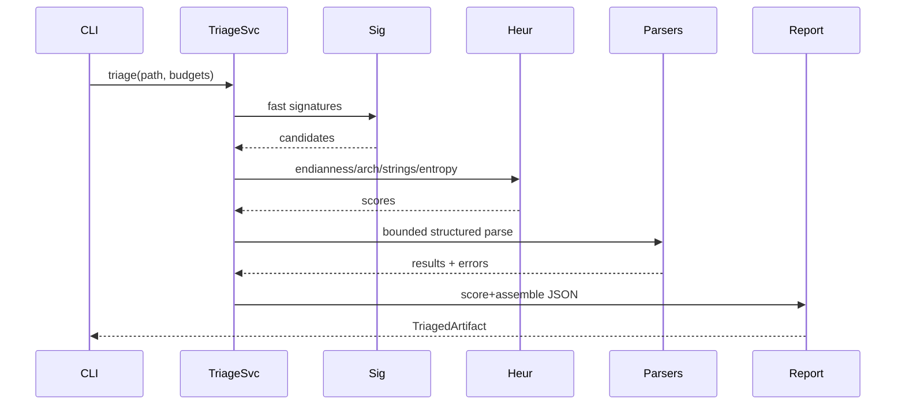
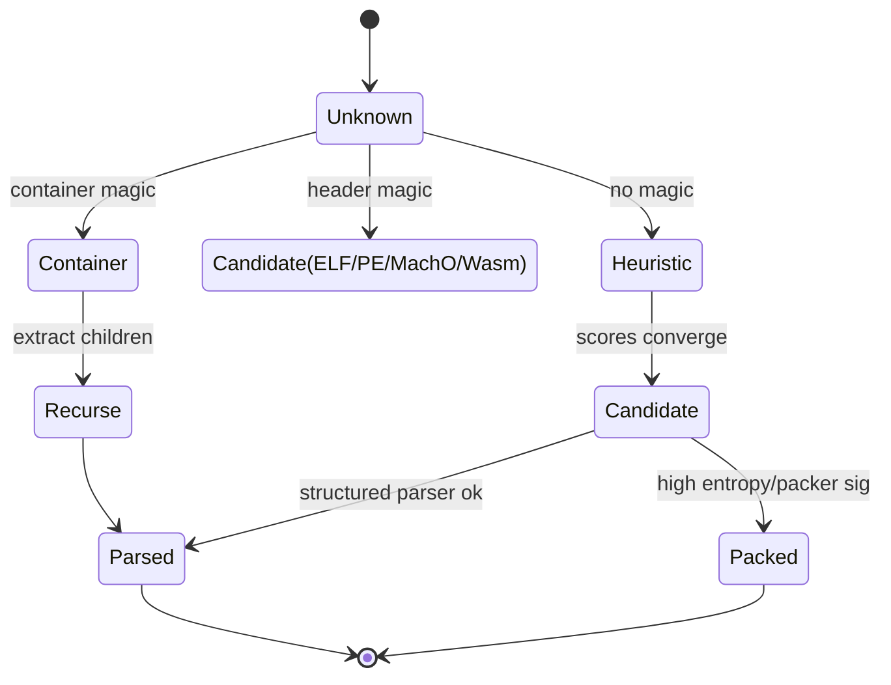

# Binary Triage Plan

This document lays out a robust, efficient, and extensible triage pipeline to identify and characterize unknown inputs: true executables (ELF/PE/Mach‑O/COFF/Wasm), embedded payloads, packed/obfuscated blobs, or non‑program containers (archives, firmware images).

Goals
- Fast, bounded, and safe: no execution; bounded I/O and CPU; resilient to corrupt inputs.
- Deterministic with confidence scoring: multiple signals combine into an overall verdict.
- Extensible: easy to add signatures, heuristics, and structured parsers.
- Composable: triage feeds structured parsers and later analysis phases.

Pipeline Overview

```mermaid
flowchart TD
  A[Input Bytes/Path/Stream] --> B[Stage 0: Normalize + Bounds]
  B --> C[Stage 1: Container/Wrapper Probe]
  C --> D{Known Signature?}
  D -- Yes --> E[Stage 2: Header Peek
   (Magic + Minimal Header)]
  D -- No --> F[Stage 3: Heuristics
   (endianness/arch/strings)]
  E --> G{Header Coherent?}
  G -- Yes --> H[Stage 4: Structured Parsers
   (object/goblin/nom)]
  G -- No --> F
  F --> I[Stage 5: Entropy/Packers]
  I --> J{Embedded Payload?}
  J -- Yes --> K[Stage 6: Recursion/Extraction]
  J -- No --> L[Stage 7: Score + Report]
  H --> L
  K --> L
```

Step‑By‑Step Plan

1) Stage 0 — Input Normalization and Bounds
- Accept path, in‑memory bytes, or stream; compute file size early.
- Hash (sha256) first 1–4 MiB chunk + full file opportunistically (cancellable) for caching.
- Map small inputs into memory; for large, use bounded buffered reads; never mmap beyond limits.
- Establish budgets (time, bytes read, nested recursion depth) to prevent explosions.

2) Stage 1 — Container/Wrapper Probe
- Check for non‑program containers first (fast signature at offset 0 and common offsets):
  - Archives/containers: zip/7z (PK\x03\x04, 7z), tar (ustar), ar ("!<arch>\n"), cpio.
  - Compressed: gzip (1F 8B), xz (FD 37 7A 58 5A), bzip2 (BZh), zstd (28 B5 2F FD), lz4 (04 22 4D 18).
  - Firmware: UEFI capsules, Android boot/Odin formats, ISO9660.
  - Script wrappers: shebang (#!) with interpreter hints.
- If matched, record container type and optionally schedule inner payload discovery (Stage 6) subject to budgets.

3) Stage 2 — Fast Signature and Minimal Header Peek
- Probe magic values at offset 0, 0x3C (PE/COFF pointer), 512, page boundaries (4 KiB), and fat headers:
  - ELF: 0x7F 'E' 'L' 'F' (e_ident); parse Class (32/64), Endianness, Type, Machine.
  - PE/COFF: 'MZ' at 0, PE header offset at 0x3C -> 'PE\0\0'; machine, characteristics.
  - Mach‑O: thin (FE ED FA CE / CF; CE FA ED FE / CF for LE), FAT (CA FE BA BE / BE BA FE CA); narch.
  - WASM: 00 61 73 6D; check version.
  - .NET/CLI: PE plus CLI header in data directories.
- Only read minimal header spans (<= 4 KiB) with strict bounds and explicit error kinds (ShortRead, BadMagic, IncoherentFields).

4) Stage 3 — Heuristics When Inconclusive
- Endianness guess:
  - Sample 16/32‑bit words across the first N KiB; compare distributions of high vs low zero bytes (big‑endian tends to have more trailing zeros for aligned code/data in some contexts).
  - Try interpreting common header fields at offsets under BE/LE assumptions and check plausibility (e.g., section counts, small integer ranges).
- Architecture guess:
  - Byte histogram comparison to known opcode frequency profiles (x86, ARM/Thumb, AArch64, MIPS, RISCV); cosine similarity yields a rough score.
  - Optional “decode viability” probe: attempt to decode small windows using multiple disassemblers (capstone/yaxpeax); measure valid‑instruction ratio (budgeted).
- Strings clue:
  - Quick scan for ASCII and UTF‑16LE/BE strings; presence of PE section names, "This program cannot be run in DOS mode", "ELF" in error strings, etc., informs scoring.
- Output: candidate list (format, arch, endianness, bits) with confidence scores.

5) Stage 4 — Entropy + Packers/Obfuscators
- Compute overall and sliding‑window Shannon entropy (e.g., 4–16 KiB windows).
- Heuristics:
  - Very high uniform entropy across most of the file suggests compression/encryption.
  - Distinct low‑entropy regions (headers) followed by high‑entropy payloads suggests packed binaries.
- Packer signature checks (fast): UPX header/section names, ASPack, Petite, etc.
- If a known packer is detected, record it and optionally schedule unpack (UPX) under sandbox rules (later phase).

6) Stage 5 — Structured Parsers (Multi‑Strategy)
- Primary: Rust "object" crate for portable parsing (ELF/PE/Mach‑O/COFF/Wasm) with bounds.
- Secondary: "goblin"/"pelite" for cross‑validation or fallback on oddities.
- Triager headers via "nom": implement tiny, resilient header parsers for ELF/PE/Mach‑O (just enough to validate invariants) that fail fast with precise errors.
- Record success/failure per parser with reasons; never trust a single signal.

7) Stage 6 — Embedded/Layered Payload Discovery
- FAT/universal binaries (Mach‑O fat): iterate architectures.
- Scanning for secondary signatures in overlays/trailers (appended data beyond last section) and within common sections (e.g., .rsrc, UPX overlay, zip at EOF).
- Extract child payloads (bounded size/count) and recurse triage with reduced budgets.
- Maintain a DAG of artifacts (parent/child with offsets and container type).

8) Stage 7 — Scoring, Classification, and Reporting
- Combine signals: signature strength, header coherence, parser success, heuristic scores, entropy, packer hits.
- Produce a ranked verdict list with confidence (0–1), plus a preferred (best) classification.
- Emit a structured TriagedArtifact JSON:
  - identity: path/hash/size
  - verdicts: [ {format, arch, bits, endian, confidence, source_signals: [...] } ]
  - entropy: overall, windowed ranges
  - strings: counts (ascii/utf16), top N samples (optional)
  - packers: matches
  - containers/children: offsets, types
  - parse_status: per‑parser results with errors
  - budgets: bytes_read, time_ms, recursion_depth

9) Stage 8 — Safety, Performance, and Limits
- Hard limits: max bytes read per stage, max recursion depth, global deadline.
- Memory limits: avoid full‑file mmap on very large inputs; stream reads; align reads to headers.
- No execution: never run user code; any unpacking must be pure userspace transforms (e.g., UPX decompressor library), not process exec.
- Graceful degradation: on timeout or limit, return partial triage with reason=BudgetExceeded.

10) Interfaces and Integration
- Rust API: `triage::triage_bytes(&[u8], Budgets) -> TriagedArtifact` and `triage_path(Path) -> TriagedArtifact`.
- Python: `glaurung.triage.analyze(path|bytes, deep=False, json=False)` via pyo3 bindings.
- CLI: `glaurung triage <path> [--json] [--deep] [--max-depth N] [--timeout MS]`.
- Service layering:



11) Libraries and Techniques
- Parsing:
  - `object` (primary multi‑format), `goblin`, `pelite` (PE specialization), `scroll` for endian reads.
  - `nom` for custom resilient header parsers and partial/streaming parsing.
- Disassembly (heuristics only at triage): `capstone-rs`, `yaxpeax-*`, `iced-x86` (if needed for x86).
- Entropy/statistics: small in‑house Shannon entropy, or `statrs` for more metrics (chi‑square, KL divergence).
- Signatures: hand‑rolled table + `aho-corasick` for fast multi‑pattern search in small windows.
- Strings: `encoding_rs` for BOM/UTF‑16 detection; fast ASCII scanning.
- Compression/containers: `flate2`, `xz2`, `bzip2`, `zstd`, `zip`, `tar` (only for identification/unpack when opted in).

12) Error Taxonomy and Confidence Model
- Error kinds: ShortRead, BadMagic, IncoherentFields, UnsupportedVariant, Truncated, BudgetExceeded, ParserMismatch.
- Confidence calculation:
  - Signature match (+0.4 strong, +0.2 weak), header coherence (+0.2), parser success (+0.3), heuristic agreement (+0.2), entropy indicates packed (adjust verdict to container/packed classification).
  - Normalize to [0,1], include per‑signal breakdown in report.

13) Testing Strategy
- Corpus: curated set from `samples/binaries/platforms/**/export` for ELF/PE/Mach‑O/Wasm; include packed (UPX) and archives.
- Unit tests: header parsers (nom) with corrupt/truncated buffers.
- Integration tests: CLI triage on small matrix; assert verdicts and key fields.
- Property tests: random truncation/corruption; ensure bounded reads and clear errors.
- Fuzzing: `cargo-fuzz` targets for header parsers and container detectors.
- Differential: compare we classify like `file(1)`/`libmagic` on the corpus (informational).

14) Incremental Delivery Roadmap
- MVP (Week 1–2): Stage 0/1/2/7 + basic entropy; object‑based parse for ELF/PE/Mach‑O; CLI triage with JSON; tests on a small matrix.
- Heuristics (Week 3): Endianness/arch scoring, strings summary, sliding entropy; confidence model v1.
- Containers/Recursion (Week 4): archive/compression detection, limited extraction, nested triage with budgets.
- Packers (Week 5): UPX detection (+ optional unpack), common packer signatures.
- Hardening (ongoing): fuzzers, property tests, timeouts/limits telemetry.

Appendix: Minimal Header Fields to Read
- ELF: e_ident[EI_CLASS/EI_DATA], e_type, e_machine, e_version; sanity: e_ehsize, e_phoff/e_shoff bounds.
- PE: DOS e_magic/e_lfanew, NT ‘PE\0\0’, filehdr.Machine/NumberOfSections, opt hdr Magic (PE32/PE32+), SizeOfHeaders bound.
- Mach‑O: magic/cputype/cpusubtype/filetype/ncmds/sizeofcmds; FAT header nfat_arch.



